# RegiTrack - Vehicle Registration Management

RegiTrack is a full-stack web application designed for administrators to view, filter, and manage vehicle registration and de-registration data. It provides a modern, responsive interface with both list and calendar views for intuitive data visualization.

## Features

-   **Dual Views:** View data in a comprehensive List View or a monthly/yearly Calendar View.
-   **Status Visualization:** Vehicle statuses (`REGISTERED`, `DEREGISTERED`) are clearly distinguished with color-coded chips.
-   **Detailed Modal:** Click on any vehicle in any view to see a detailed information modal.
-   **Advanced Filtering:** Filter the entire dataset by status, vehicle type (5-seat/7-seat), and class (Personal/Commercial).
-   **Responsive Design:** The UI is fully responsive, providing a seamless experience on both desktop and mobile devices.
-   **Themed UI:** A professional and consistent user interface built with a custom Material-UI theme.

## Tech Stack

-   **Frontend:** React, TypeScript, Vite, Material-UI (MUI)
-   **Backend:** Node.js, Express, TypeScript
-   **Monorepo:** `pnpm` workspaces
-   **Containerization:** Docker & Docker Compose
-   **Infrastructure as Code:** Terraform
-   **Cloud Provider:** Amazon Web Services (AWS)
-   **CI/CD:** GitHub Actions
-   **AWS Services:** VPC, Subnets, ECS, Fargate, ECR, Application Load Balancer, IAM

## Local Development

1.  Ensure you have Docker Desktop and `pnpm` installed.
2.  Clone the repository.
3.  From the project root, run the development environment:
    ```bash
    docker compose up --build
    ```
4.  The frontend will be available at `http://localhost:5173`.
5.  The backend API will be available at `http://localhost:3000`.

## Production Deployment

The project is configured for automated deployment to AWS via a unified CI/CD pipeline using GitHub Actions.

1.  The infrastructure is defined in the `/terraform` directory and can be provisioned with `terraform apply`.
2.  The GitHub Actions workflow in `.github/workflows/main.yml` handles automated building, testing, and deployment.
3.  Deployments to the `main` branch will automatically update the running services on AWS ECS.

## Logical View (C4 Component Diagram)

### Stage 01: MVP - Monolithic Deployment

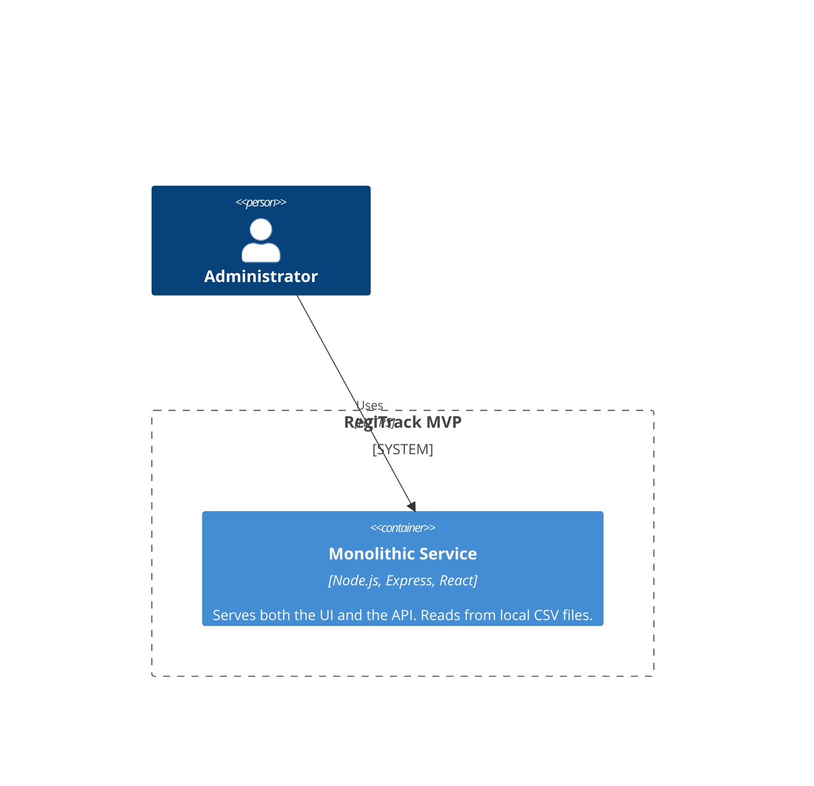
```mermaid
C4Component
  Person(admin, "Administrator")
  System_Boundary(regitrack_mvp, "RegiTrack MVP") {
    Container(monolith, "Monolithic Service", "Node.js, Express, React", "Serves both the UI and the API. Reads from local CSV files.")
  }
  Rel(admin, monolith, "Uses", "HTTPS")
```

### Stage 02: Decouple Frontend and Backend for Scalability

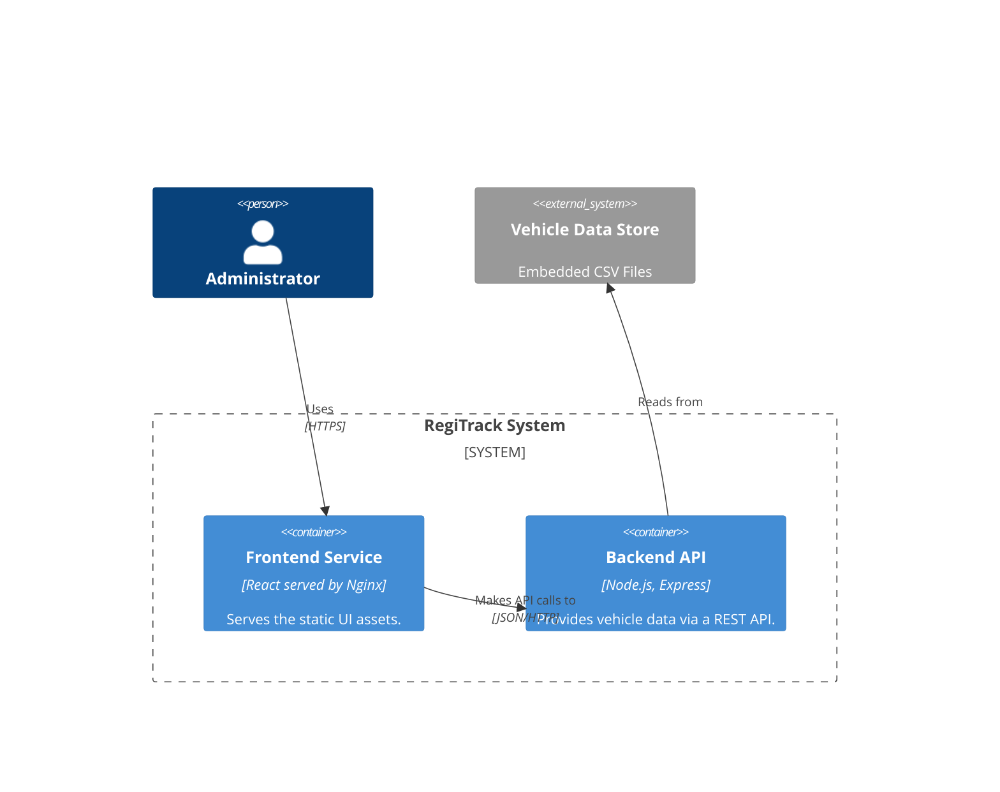
```mermaid
C4Component
  Person(admin, "Administrator")
  System_Boundary(regitrack, "RegiTrack System") {
    Container(frontend, "Frontend Service", "React served by Nginx", "Serves the static UI assets.")
    Container(backend, "Backend API", "Node.js, Express", "Provides vehicle data via a REST API.")
  }
  System_Ext(data, "Vehicle Data Store", "Embedded CSV Files")

  Rel(admin, frontend, "Uses", "HTTPS")
  Rel(frontend, backend, "Makes API calls to", "JSON/HTTP")
  Rel(backend, data, "Reads from")
```

### Stage 03: Automate Deployment with a CI/CD Pipeline

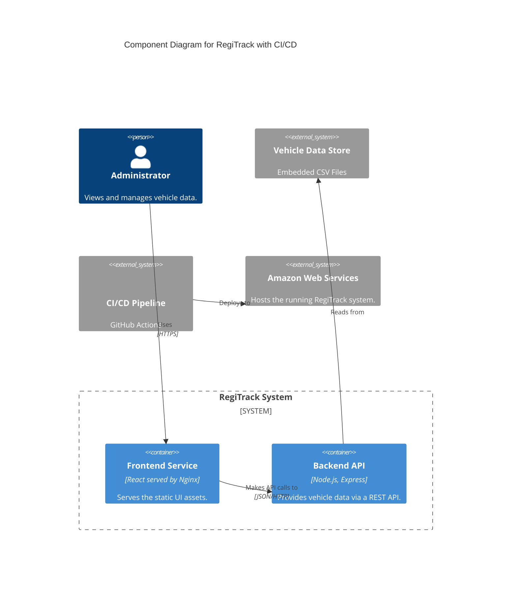
```mermaid
C4Component
  title Component Diagram for RegiTrack with CI/CD

  Person(admin, "Administrator", "Views and manages vehicle data.")
  
  System_Boundary(regitrack, "RegiTrack System") {
    Container(frontend, "Frontend Service", "React served by Nginx", "Serves the static UI assets.")
    Container(backend, "Backend API", "Node.js, Express", "Provides vehicle data via a REST API.")
  }

  System_Ext(data, "Vehicle Data Store", "Embedded CSV Files")
  System_Ext(cicd, "CI/CD Pipeline", "GitHub Actions", "Automates the building and deployment of the system.")
  System_Ext(aws, "Amazon Web Services", "Hosts the running RegiTrack system.")

  Rel(admin, frontend, "Uses", "HTTPS")
  Rel(frontend, backend, "Makes API calls to", "JSON/HTTP")
  Rel(backend, data, "Reads from")
  
  Rel(cicd, aws, "Deploys to")
```

### Stage 04: Implement a Secure Network Topology


```mermaid
C4Component
  title Component Diagram for Moving the API service to the private subnets

  Person(admin, "Administrator", "Views and manages vehicle data.")
  
  System_Boundary(regitrack, "RegiTrack System") {
    Container(frontend, "Frontend Service", "React served by Nginx", "Serves the static UI assets.")
    Container(backend, "Backend API", "Node.js, Express", "Provides vehicle data via a REST API.")
  }

  System_Ext(data, "Vehicle Data Store", "Embedded CSV Files")
  System_Ext(cicd, "CI/CD Pipeline", "GitHub Actions", "Automates the building and deployment of the system.")
  System_Ext(aws, "Amazon Web Services", "Hosts the running RegiTrack system.")

  Rel(admin, frontend, "Uses", "HTTPS")
  Rel(frontend, backend, "Makes API calls to", "JSON/HTTP")
  Rel(backend, data, "Reads from")
  
  Rel(cicd, aws, "Deploys to")
```

### Stage 05: Decouple Data with a Managed Database

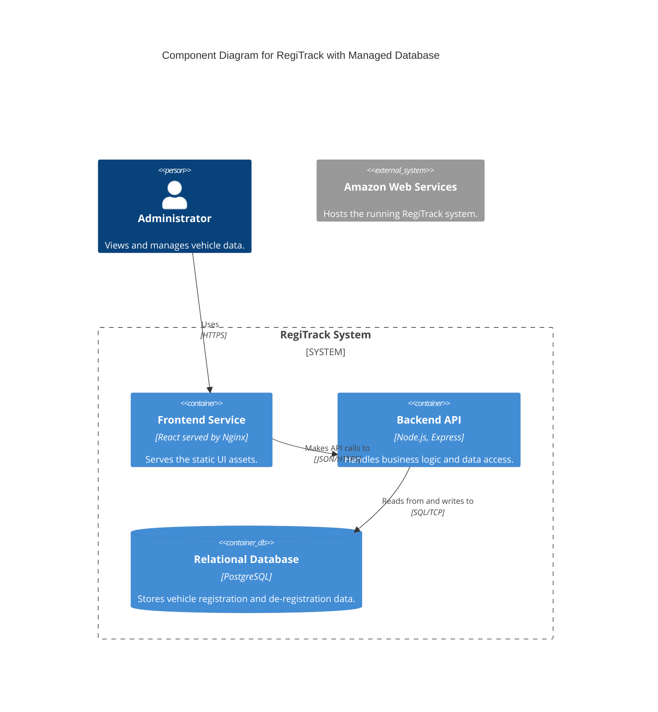
```mermaid
C4Component
  title Component Diagram for RegiTrack with Managed Database

  Person(admin, "Administrator", "Views and manages vehicle data.")
  
  System_Boundary(regitrack, "RegiTrack System") {
    Container(frontend, "Frontend Service", "React served by Nginx", "Serves the static UI assets.")
    Container(backend, "Backend API", "Node.js, Express", "Handles business logic and data access.")
    ContainerDb(db, "Relational Database", "PostgreSQL", "Stores vehicle registration and de-registration data.")
  }

  System_Ext(aws, "Amazon Web Services", "Hosts the running RegiTrack system.")

  Rel(admin, frontend, "Uses", "HTTPS")
  Rel(frontend, backend, "Makes API calls to", "JSON/HTTPS")
  Rel(backend, db, "Reads from and writes to", "SQL/TCP")
```

### Stage 06: Implement Observability (Logging, Metrics, and Alarms)

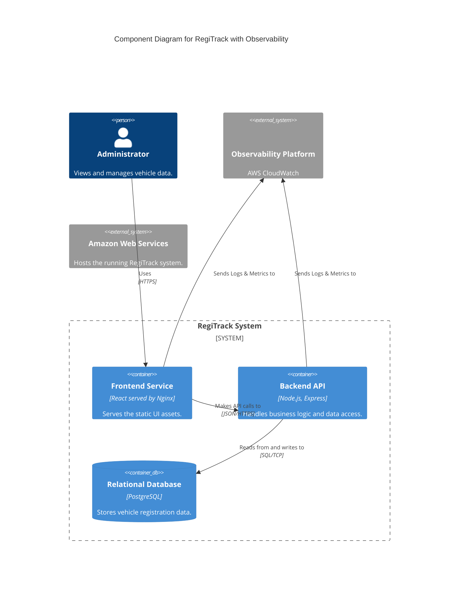
```mermaid
C4Component
  title Component Diagram for RegiTrack with Observability

  Person(admin, "Administrator", "Views and manages vehicle data.")
  
  System_Boundary(regitrack, "RegiTrack System") {
    Container(frontend, "Frontend Service", "React served by Nginx", "Serves the static UI assets.")
    Container(backend, "Backend API", "Node.js, Express", "Handles business logic and data access.")
    ContainerDb(db, "Relational Database", "PostgreSQL", "Stores vehicle registration data.")
  }

  System_Ext(monitoring, "Observability Platform", "AWS CloudWatch", "Collects logs and metrics for monitoring and alerting.")
  System_Ext(aws, "Amazon Web Services", "Hosts the running RegiTrack system.")

  Rel(admin, frontend, "Uses", "HTTPS")
  Rel(frontend, backend, "Makes API calls to", "JSON/HTTPS")
  Rel(backend, db, "Reads from and writes to", "SQL/TCP")
  
  Rel(frontend, monitoring, "Sends Logs & Metrics to")
  Rel(backend, monitoring, "Sends Logs & Metrics to")
```

### Stage 07: Harden Security with Secrets Management

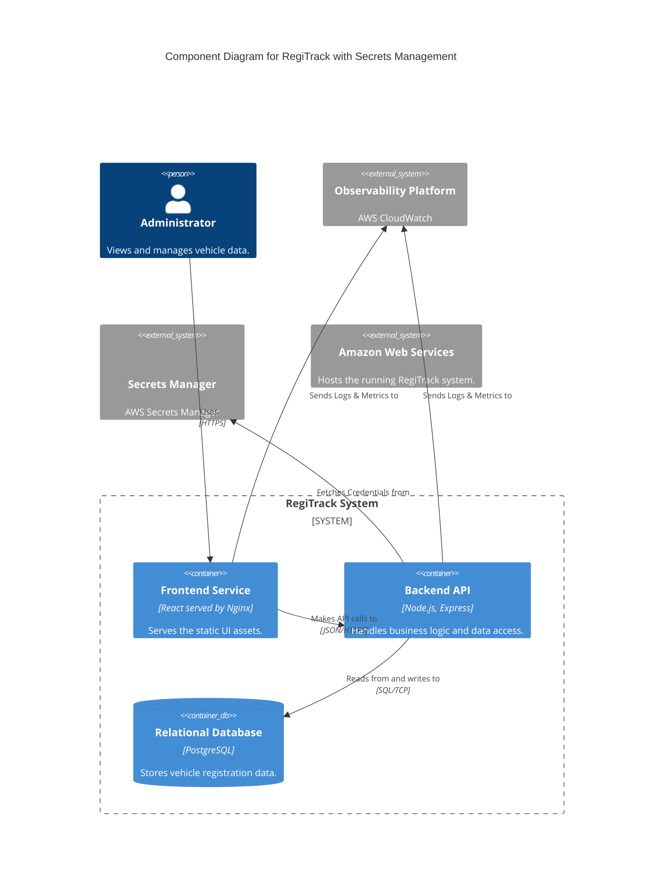
```mermaid
C4Component
  title Component Diagram for RegiTrack with Secrets Management

  Person(admin, "Administrator", "Views and manages vehicle data.")
  
  System_Boundary(regitrack, "RegiTrack System") {
    Container(frontend, "Frontend Service", "React served by Nginx", "Serves the static UI assets.")
    Container(backend, "Backend API", "Node.js, Express", "Handles business logic and data access.")
    ContainerDb(db, "Relational Database", "PostgreSQL", "Stores vehicle registration data.")
  }

  System_Ext(monitoring, "Observability Platform", "AWS CloudWatch")
  System_Ext(secrets, "Secrets Manager", "AWS Secrets Manager", "Provides secure storage and retrieval of database credentials.")
  System_Ext(aws, "Amazon Web Services", "Hosts the running RegiTrack system.")

  Rel(admin, frontend, "Uses", "HTTPS")
  Rel(frontend, backend, "Makes API calls to", "JSON/HTTPS")
  Rel(backend, db, "Reads from and writes to", "SQL/TCP")
  Rel(backend, secrets, "Fetches Credentials from")
  
  Rel(frontend, monitoring, "Sends Logs & Metrics to")
  Rel(backend, monitoring, "Sends Logs & Metrics to")
```

### Stage 08: Ensure Data Integrity with Database Migrations

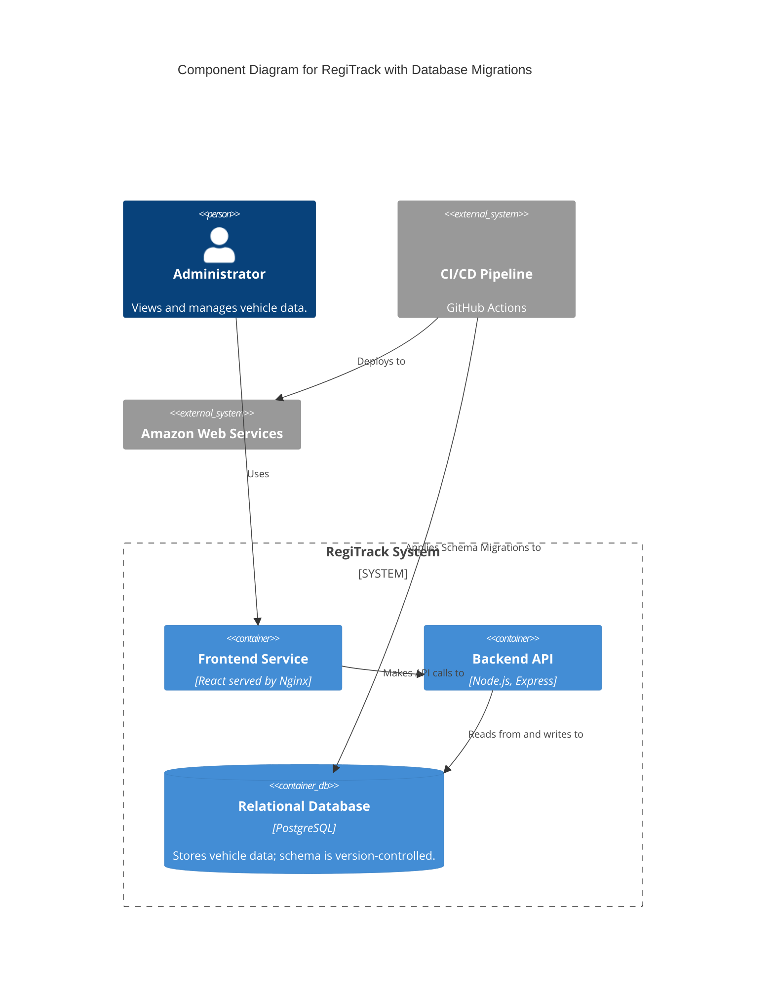
```mermaid
C4Component
  title Component Diagram for RegiTrack with Database Migrations

  Person(admin, "Administrator", "Views and manages vehicle data.")
  
  System_Boundary(regitrack, "RegiTrack System") {
    Container(frontend, "Frontend Service", "React served by Nginx")
    Container(backend, "Backend API", "Node.js, Express")
    ContainerDb(db, "Relational Database", "PostgreSQL", "Stores vehicle data; schema is version-controlled.")
  }

  System_Ext(cicd, "CI/CD Pipeline", "GitHub Actions", "Builds, migrates, and deploys the system.")
  System_Ext(aws, "Amazon Web Services")

  Rel(admin, frontend, "Uses")
  Rel(frontend, backend, "Makes API calls to")
  Rel(backend, db, "Reads from and writes to")
  
  Rel(cicd, db, "Applies Schema Migrations to")
  Rel(cicd, aws, "Deploys to")
```

### Stage 09: Enhance Resiliency with Auto Scaling

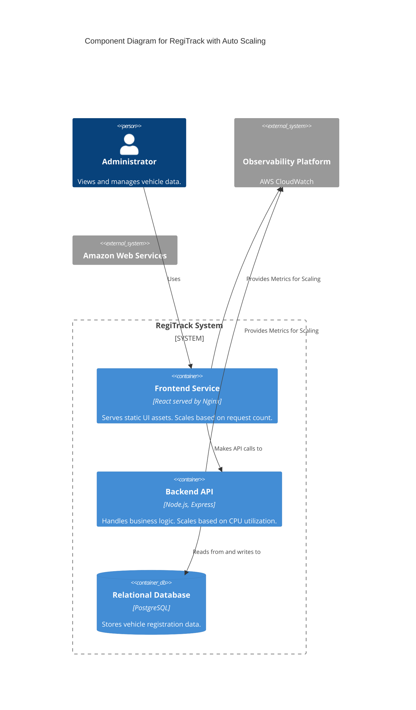
```mermaid
C4Component
  title Component Diagram for RegiTrack with Auto Scaling

  Person(admin, "Administrator", "Views and manages vehicle data.")
  
  System_Boundary(regitrack, "RegiTrack System") {
    Container(frontend, "Frontend Service", "React served by Nginx", "Serves static UI assets. Scales based on request count.")
    Container(backend, "Backend API", "Node.js, Express", "Handles business logic. Scales based on CPU utilization.")
    ContainerDb(db, "Relational Database", "PostgreSQL", "Stores vehicle registration data.")
  }

  System_Ext(monitoring, "Observability Platform", "AWS CloudWatch", "Provides the metrics that trigger scaling events.")
  System_Ext(aws, "Amazon Web Services")

  Rel(admin, frontend, "Uses")
  Rel(frontend, backend, "Makes API calls to")
  Rel(backend, db, "Reads from and writes to")
  
  Rel(frontend, monitoring, "Provides Metrics for Scaling")
  Rel(backend, monitoring, "Provides Metrics for Scaling")
```

## Physical View (AWS Deployment Diagram)

### Stage 01: MVP - Monolithic Deployment

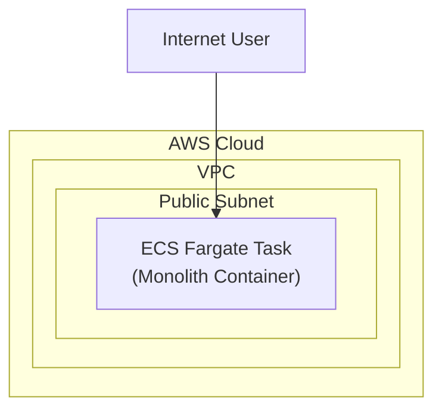
```mermaid
graph TD
  subgraph "AWS Cloud"
    subgraph "VPC"
      subgraph "Public Subnet"
        Task["ECS Fargate Task <br> (Monolith Container)"]
      end
    end
  end
  User[Internet User] --> Task
```

### Stage 02: Decouple Frontend and Backend for Scalability

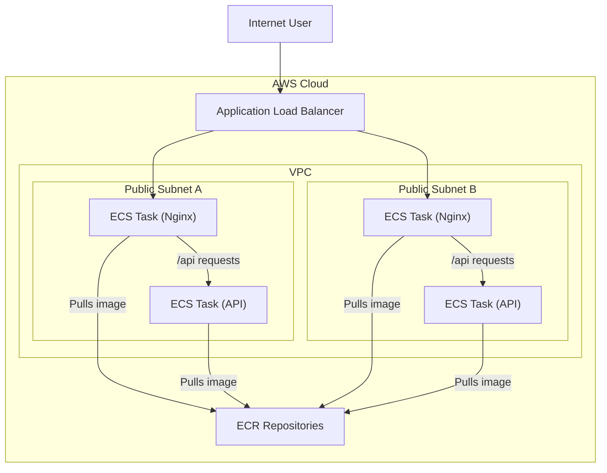
```mermaid
graph TD
  subgraph "AWS Cloud"
    ALB[Application Load Balancer]
    ECR[ECR Repositories]
    subgraph "VPC"
      subgraph "Public Subnet A"
        NginxTaskA["ECS Task (Nginx)"]
        ApiTaskA["ECS Task (API)"]
      end
      subgraph "Public Subnet B"
        NginxTaskB["ECS Task (Nginx)"]
        ApiTaskB["ECS Task (API)"]
      end
    end
  end

  User[Internet User] --> ALB
  
  %% ALB only talks to Nginx
  ALB --> NginxTaskA
  ALB --> NginxTaskB

  %% Nginx proxies traffic to the API service
  NginxTaskA -- "/api requests" --> ApiTaskA
  NginxTaskB -- "/api requests" --> ApiTaskB
  
  %% Tasks pull images from ECR
  NginxTaskA -- "Pulls image" --> ECR
  ApiTaskA -- "Pulls image" --> ECR
  NginxTaskB -- "Pulls image" --> ECR
  ApiTaskB -- "Pulls image" --> ECR
```

### Stage 03: Automate Deployment with a CI/CD Pipeline

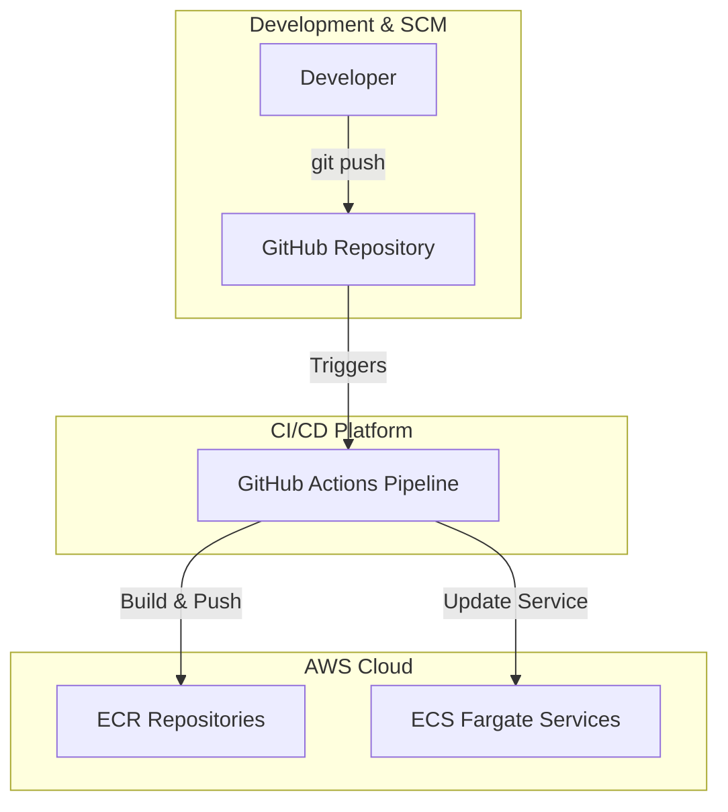
```mermaid
graph TD
    subgraph "Development & SCM"
        Dev[Developer] -- "git push" --> Repo[GitHub Repository]
    end

    subgraph "CI/CD Platform"
        Repo -- Triggers --> GHA[GitHub Actions Pipeline]
    end

    subgraph "AWS Cloud"
        ECR[ECR Repositories]
        ECS[ECS Fargate Services]
    end

    GHA -- "Build & Push" --> ECR
    GHA -- "Update Service" --> ECS
```

### Stage 04: Implement a Secure Network Topology

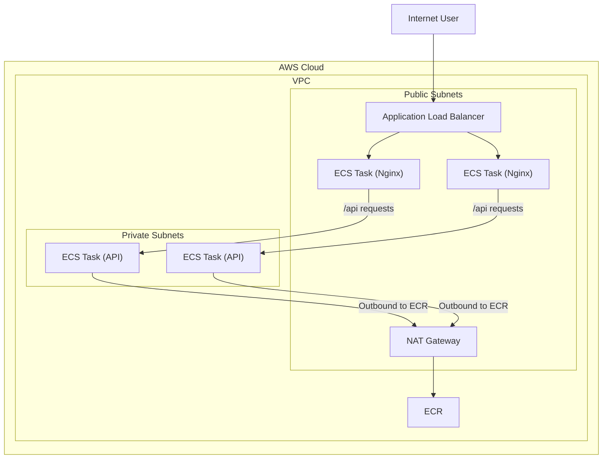
```mermaid
graph TD
  subgraph "AWS Cloud"
    ECR
    subgraph "VPC"
      subgraph "Public Subnets"
        ALB[Application Load Balancer]
        NAT[NAT Gateway]
        NginxTaskA["ECS Task (Nginx)"]
        NginxTaskB["ECS Task (Nginx)"]
      end
      subgraph "Private Subnets"
        ApiTaskA["ECS Task (API)"]
        ApiTaskB["ECS Task (API)"]
      end

      ALB --> NginxTaskA
      ALB --> NginxTaskB

      %% Internal service-to-service communication
      NginxTaskA -- "/api requests" --> ApiTaskA
      NginxTaskB -- "/api requests" --> ApiTaskB
      
      %% Outbound traffic from private subnets
      ApiTaskA -- "Outbound to ECR" --> NAT
      ApiTaskB -- "Outbound to ECR" --> NAT
      NAT --> ECR
    end
  end
  User[Internet User] --> ALB
```

### Stage 05: Decouple Data with a Managed Database

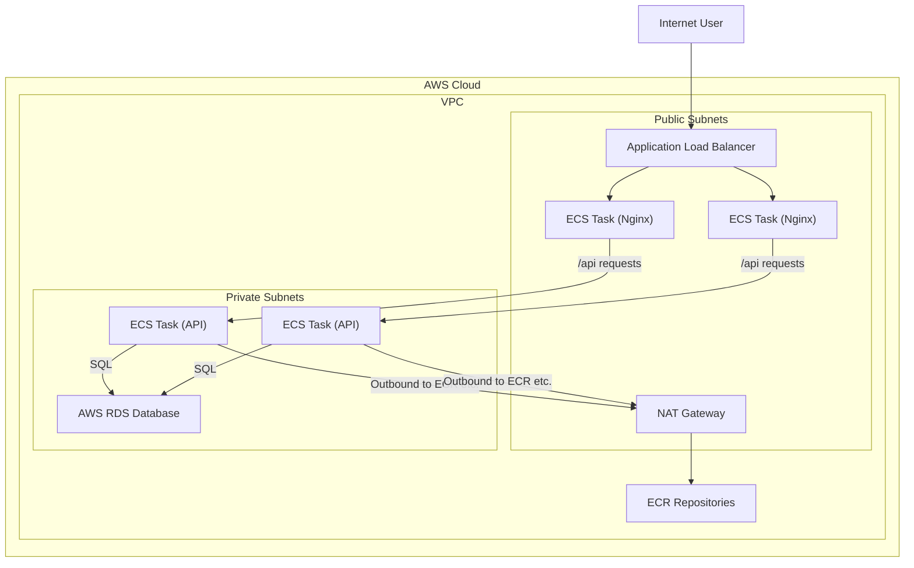
```mermaid
graph TD
  subgraph "AWS Cloud"
    ECR[ECR Repositories]
    subgraph "VPC"
      subgraph "Public Subnets"
        ALB[Application Load Balancer]
        NAT[NAT Gateway]
        NginxTaskA["ECS Task (Nginx)"]
        NginxTaskB["ECS Task (Nginx)"]
      end
      
      subgraph "Private Subnets"
        ApiTaskA["ECS Task (API)"]
        ApiTaskB["ECS Task (API)"]
        DB[AWS RDS Database]
      end

      ALB --> NginxTaskA
      ALB --> NginxTaskB

      %% Internal traffic from Nginx to API
      NginxTaskA -- "/api requests" --> ApiTaskA
      NginxTaskB -- "/api requests" --> ApiTaskB
      
      %% Internal traffic from API to Database
      ApiTaskA -- "SQL" --> DB
      ApiTaskB -- "SQL" --> DB
      
      %% Outbound traffic from private API tasks to the internet
      ApiTaskA -- "Outbound to ECR etc." --> NAT
      ApiTaskB -- "Outbound to ECR etc." --> NAT
      NAT --> ECR
    end
  end
  User[Internet User] --> ALB
```

### Stage 06: Implement Observability (Logging, Metrics, and Alarms)

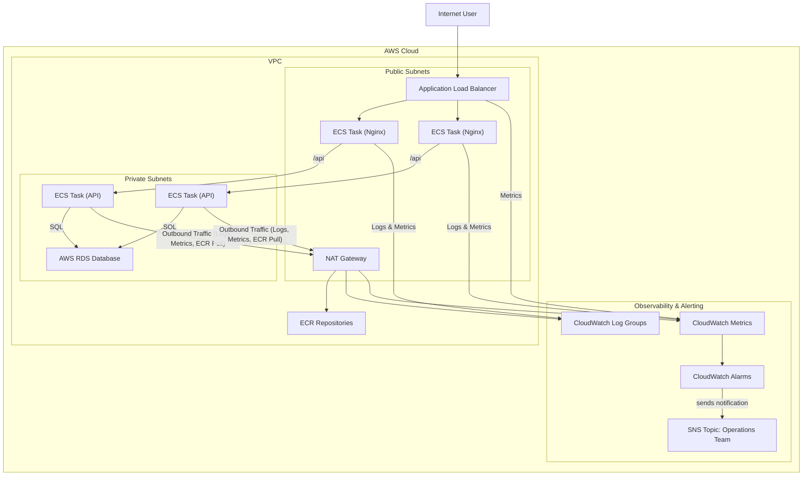
```mermaid
graph TD
  subgraph "AWS Cloud"
    subgraph "Observability & Alerting"
      CW_Logs[CloudWatch Log Groups]
      CW_Metrics[CloudWatch Metrics]
      CW_Alarms[CloudWatch Alarms]
      SNS[SNS Topic: Operations Team]
      
      CW_Metrics --> CW_Alarms
      CW_Alarms -- "sends notification" --> SNS
    end

    ECR[ECR Repositories]
    subgraph "VPC"
      subgraph "Public Subnets"
        ALB[Application Load Balancer]
        NAT[NAT Gateway]
        NginxTaskA["ECS Task (Nginx)"]
        NginxTaskB["ECS Task (Nginx)"]
      end
      
      subgraph "Private Subnets"
        ApiTaskA["ECS Task (API)"]
        ApiTaskB["ECS Task (API)"]
        DB[AWS RDS Database]
      end

      ALB --> NginxTaskA
      ALB --> NginxTaskB

      NginxTaskA -- "/api" --> ApiTaskA
      NginxTaskB -- "/api" --> ApiTaskB
      
      ApiTaskA -- "SQL" --> DB
      ApiTaskB -- "SQL" --> DB
      
      %% --- Simplified & Corrected Outbound Paths ---
      %% Public tasks send telemetry directly
      NginxTaskA -- "Logs & Metrics" --> CW_Logs
      NginxTaskB -- "Logs & Metrics" --> CW_Metrics
      ALB -- "Metrics" --> CW_Metrics

      %% Private tasks send ALL outbound traffic via NAT Gateway
      ApiTaskA -- "Outbound Traffic (Logs, Metrics, ECR Pull)" --> NAT
      ApiTaskB -- "Outbound Traffic (Logs, Metrics, ECR Pull)" --> NAT
      NAT --> ECR
      NAT --> CW_Logs
      NAT --> CW_Metrics
    end
  end
  User[Internet User] --> ALB
```

### Stage 07: Harden Security with Secrets Management

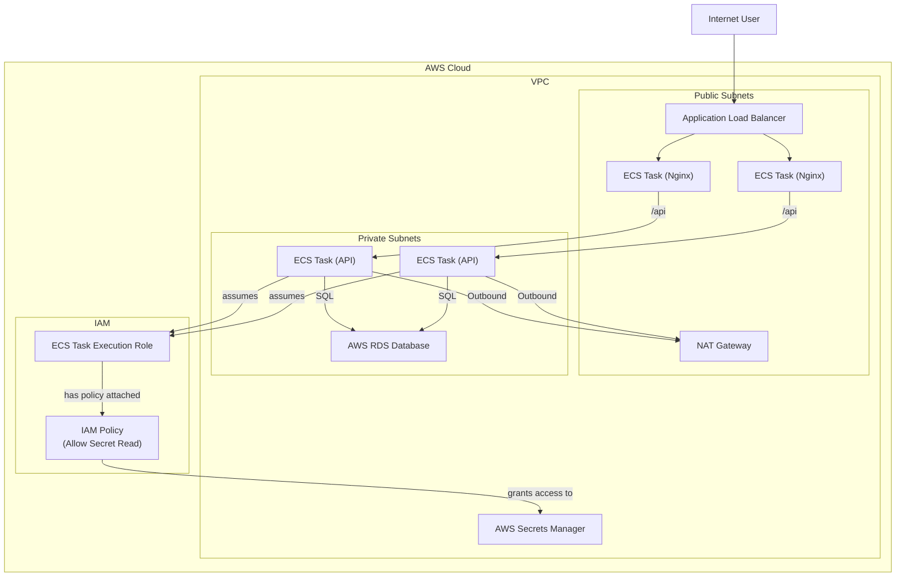
```mermaid
graph TD
  subgraph "AWS Cloud"
    Secrets[AWS Secrets Manager]
    
    subgraph "IAM"
      Role[ECS Task Execution Role]
      Policy["IAM Policy<br>(Allow Secret Read)"]
      Role -- "has policy attached" --> Policy
    end

    subgraph "VPC"
      subgraph "Public Subnets"
        ALB[Application Load Balancer]
        NAT[NAT Gateway]
        NginxTaskA["ECS Task (Nginx)"]
        NginxTaskB["ECS Task (Nginx)"]
      end
      
      subgraph "Private Subnets"
        ApiTaskA["ECS Task (API)"]
        ApiTaskB["ECS Task (API)"]
        DB[AWS RDS Database]
      end

      ALB --> NginxTaskA
      ALB --> NginxTaskB

      NginxTaskA -- "/api" --> ApiTaskA
      NginxTaskB -- "/api" --> ApiTaskB
      
      ApiTaskA -- "SQL" --> DB
      ApiTaskB -- "SQL" --> DB
      
      ApiTaskA -- "Outbound" --> NAT
      ApiTaskB -- "Outbound" --> NAT
      
      %% --- Corrected Security Relationships ---
      ApiTaskA -- "assumes" --> Role
      ApiTaskB -- "assumes" --> Role
      Policy -- "grants access to" --> Secrets
    end
  end
  User[Internet User] --> ALB
```

### Stage 08: Ensure Data Integrity with Database Migrations

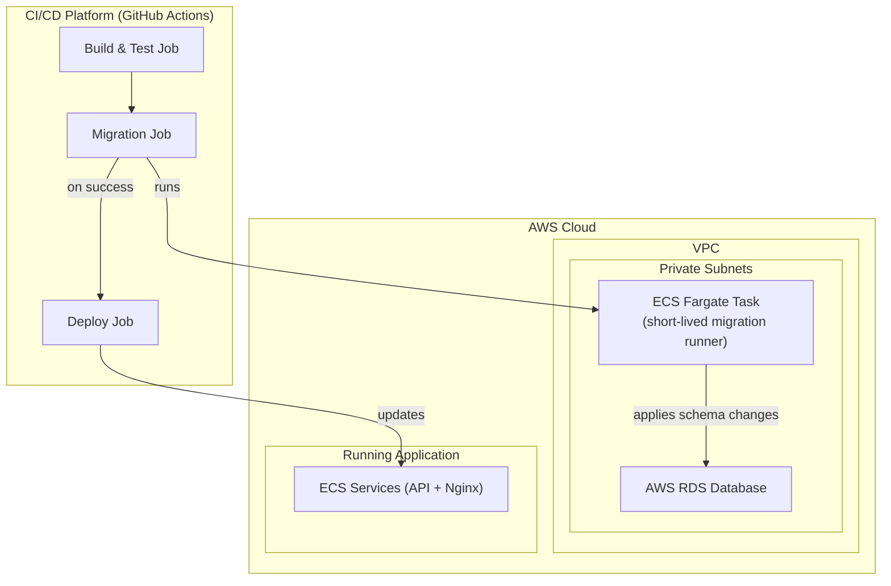
```mermaid
graph TD
  subgraph "CI/CD Platform (GitHub Actions)"
    A[Build & Test Job] --> B[Migration Job];
    B -- "on success" --> C[Deploy Job];
  end

  subgraph "AWS Cloud"
    subgraph "VPC"
      subgraph "Private Subnets"
        DB[AWS RDS Database]
        MigrateTask["ECS Fargate Task<br>(short-lived migration runner)"]
      end
    end
    
    subgraph "Running Application"
      ECS["ECS Services (API + Nginx)"]
    end
  end

  B -- "runs" --> MigrateTask;
  MigrateTask -- "applies schema changes" --> DB;
  C -- "updates" --> ECS;
```

### Stage 09: Enhance Resiliency with Auto Scaling

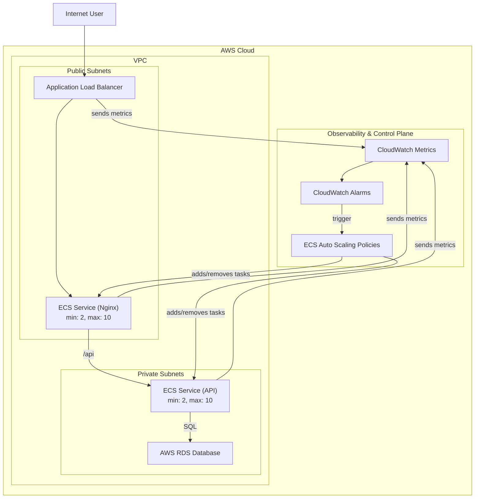
```mermaid
graph TD
  subgraph "AWS Cloud"
    subgraph "Observability & Control Plane"
      Metrics[CloudWatch Metrics]
      Alarms[CloudWatch Alarms]
      ScalingPolicy[ECS Auto Scaling Policies]
      
      Metrics --> Alarms
      Alarms -- "trigger" --> ScalingPolicy
    end

    subgraph "VPC"
      subgraph "Public Subnets"
        ALB[Application Load Balancer]
        NginxTasks["ECS Service (Nginx)<br>min: 2, max: 10"]
      end
      
      subgraph "Private Subnets"
        ApiTasks["ECS Service (API)<br>min: 2, max: 10"]
        DB[AWS RDS Database]
      end

      ALB --> NginxTasks
      NginxTasks -- "/api" --> ApiTasks
      ApiTasks -- "SQL" --> DB
      
      %% --- Auto Scaling Relationships ---
      ScalingPolicy -- "adds/removes tasks" --> NginxTasks
      ScalingPolicy -- "adds/removes tasks" --> ApiTasks

      ALB -- "sends metrics" --> Metrics
      NginxTasks -- "sends metrics" --> Metrics
      ApiTasks -- "sends metrics" --> Metrics
    end
  end
  User[Internet User] --> ALB
```
