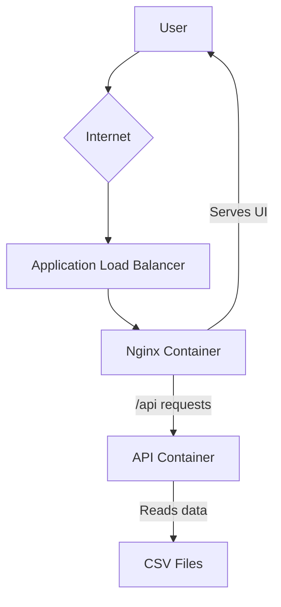
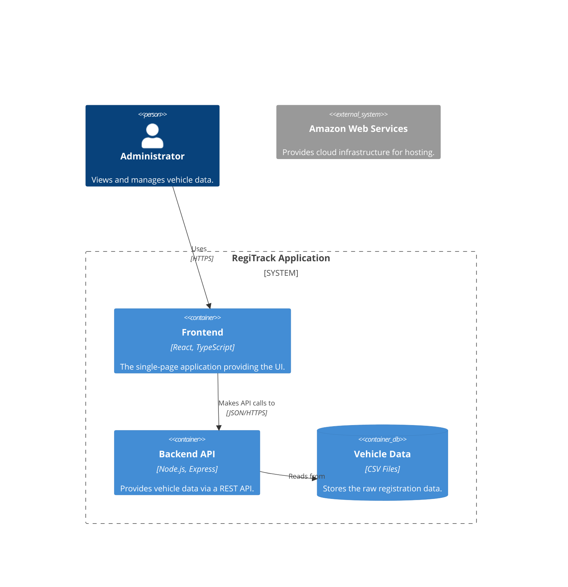
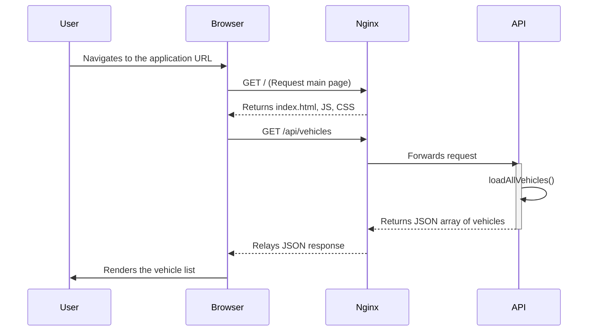
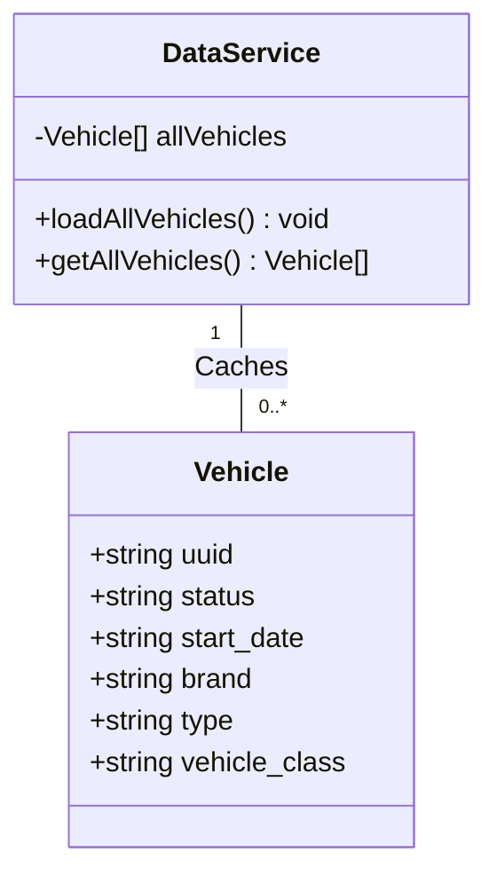
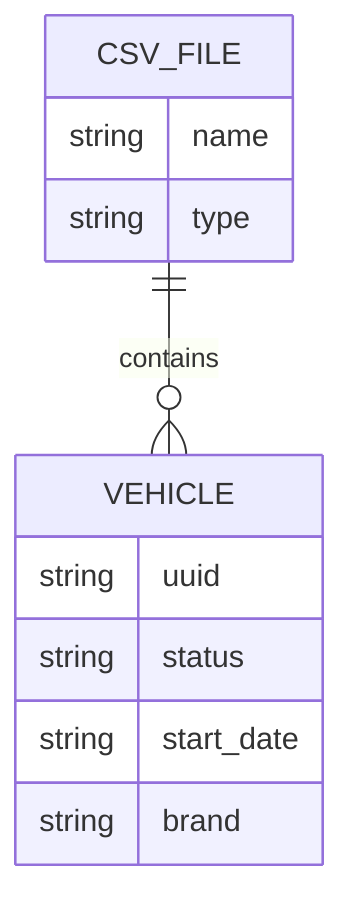
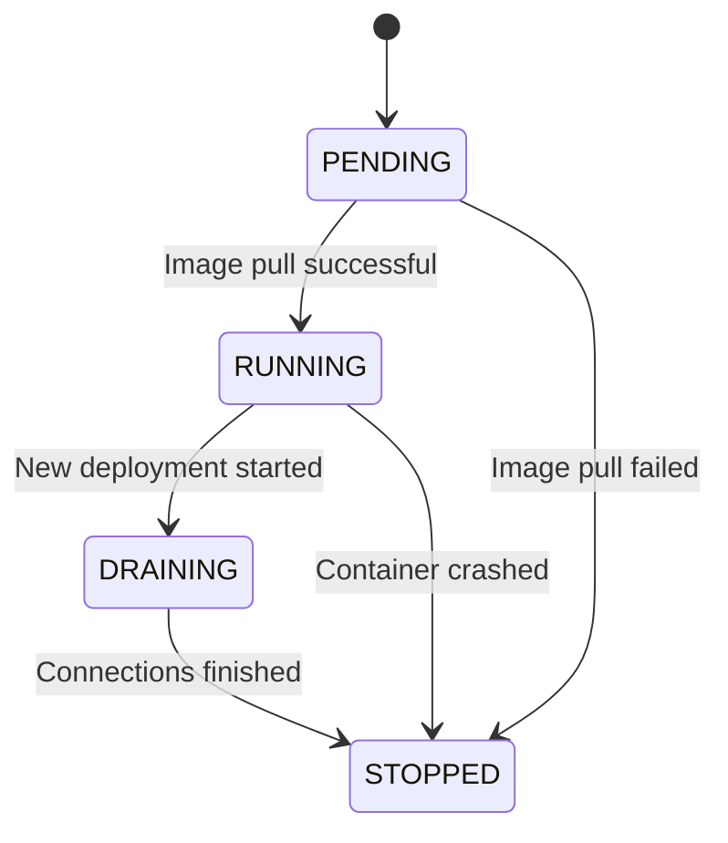
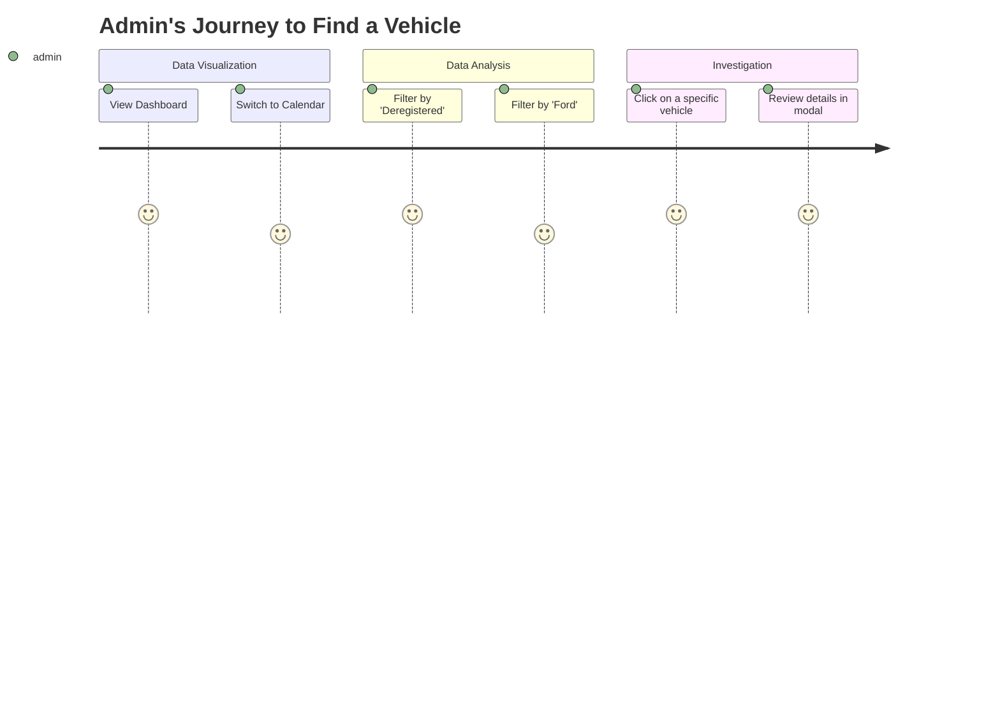
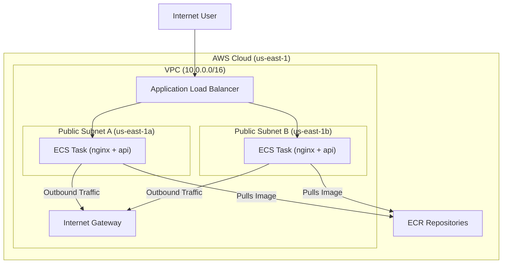
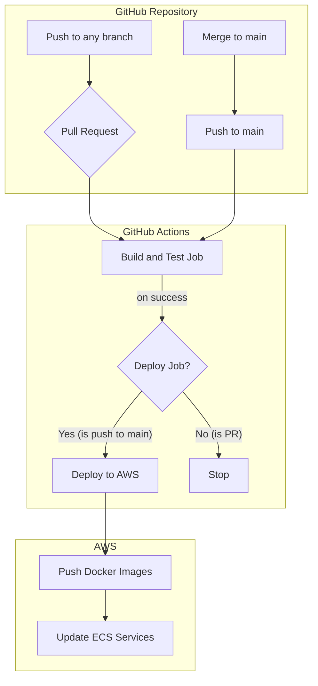
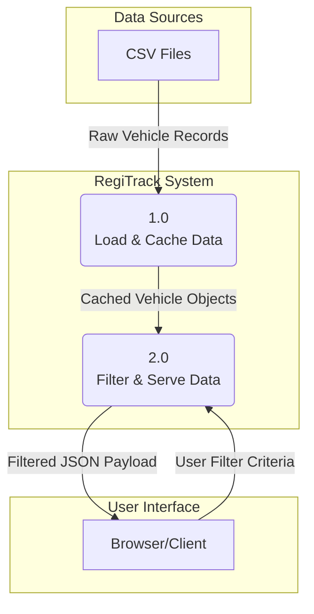

# RegiTrack - Architectural Design

This document outlines the architecture and design of the RegiTrack application using various diagrams.

### High-Level Architecture Diagram

This diagram shows the overall flow of traffic from the user to the running services on AWS.

### C4 Component Diagram

This diagram shows the major components within the RegiTrack system.

### Sequence Diagram (API Request Flow)

This diagram illustrates the sequence of events when a user loads the application.

### Class Diagram (Backend)

This diagram shows the logical structure of the backend's data handling.

### Entity Relationship Diagram (ERD)

This ERD shows the logical relationship between the data sources and the vehicle records.

### State Diagram (ECS Task Lifecycle)

This diagram shows the states an ECS Fargate task transitions through during a deployment.

### User Journey Map

This map outlines the typical journey of an administrator using the application.

### Cloud Infrastructure Diagram

The relationships between the VPC, Subnets, Internet Gateway, Load Balancer, and the ECS services.

### CI/CD Pipeline Diagram

### Data Flow Diagram (DFD)

The path data takes from its source, through processing steps, to its destination.

