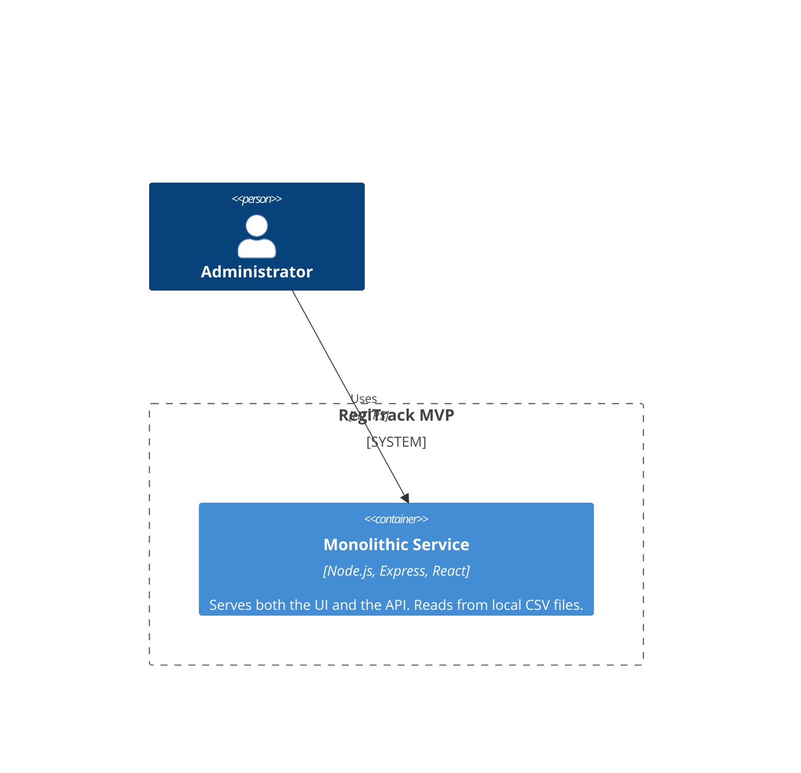
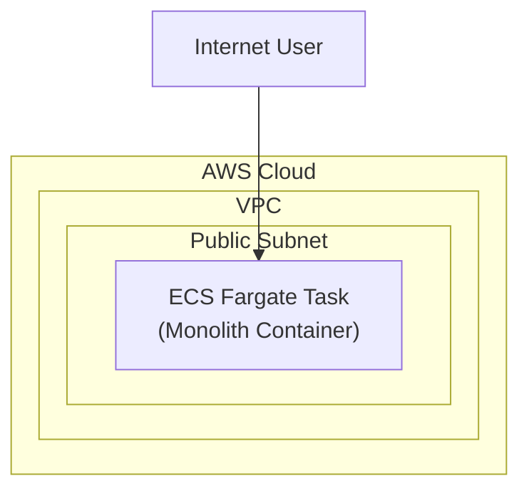

**Architecture-as-Code (AaC) Artifacts:**

**1. Logical View (C4 Component Diagram)**

**2. Physical View (AWS Deployment Diagram)**

**3. Component-to-Resource Mapping Table**

| Logical Component | Physical Resource | Rationale |
| :--- | :--- | :--- |
| Monolithic Service | AWS ECS Fargate Task | A simple, serverless way to run a single container. |
