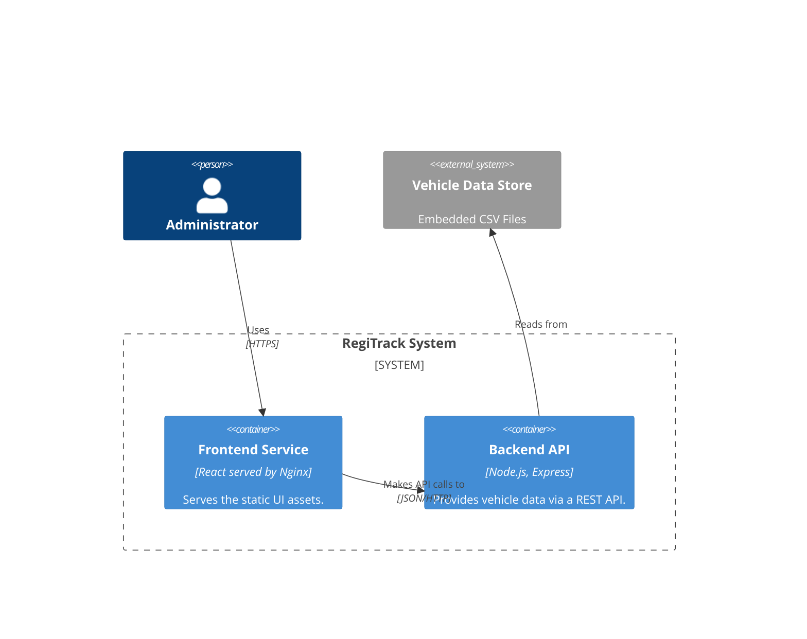
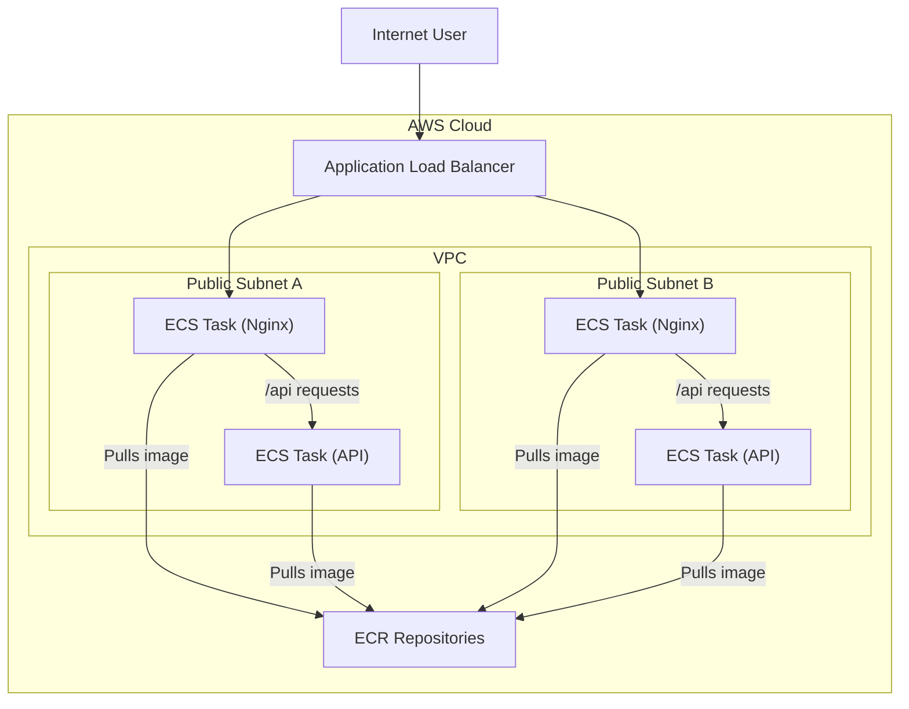

**Architecture-as-Code (AaC) Artifacts:**

**1. Logical View (C4 Component Diagram)**

**2. Physical View (AWS Deployment Diagram)**

**3. Component-to-Resource Mapping Table**

| Logical Component | Physical Resource | Rationale |
| :--- | :--- | :--- |
| Frontend Service | AWS ECS Fargate Service (Nginx) | Serverless container orchestration for the web server. |
| Backend API | AWS ECS Fargate Service (Node.js) | Independent, serverless scaling for the API. |
| (Load Balancer) | AWS Application Load Balancer | Manages traffic, enables scaling and HA. |
| (Image Storage) | AWS Elastic Container Registry | Secure, managed storage for Docker images. |
