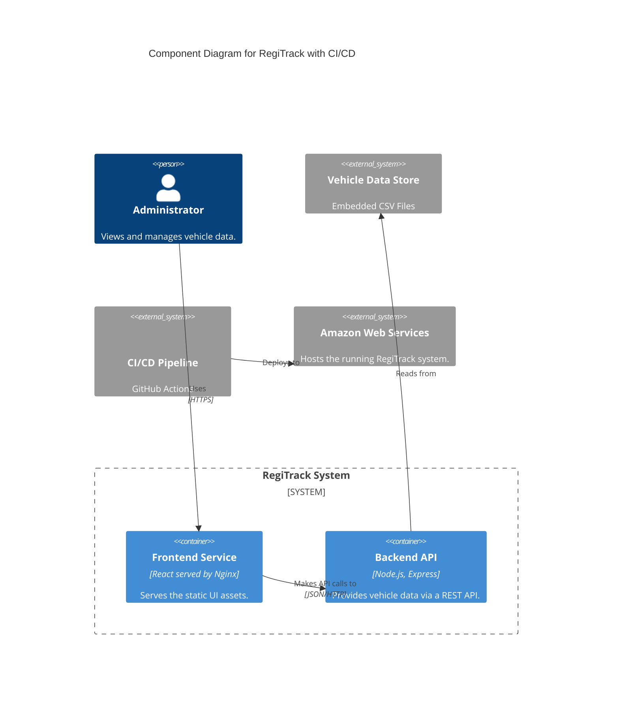
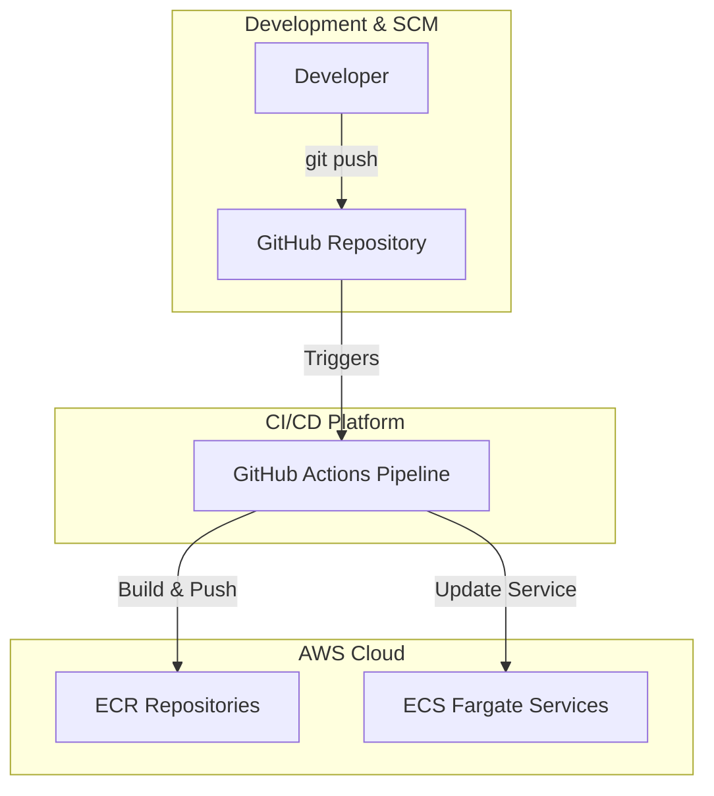

**Architecture-as-Code (AaC) Artifacts:**

**1. Logical View (C4 Component Diagram)**

**2. Physical View (AWS Deployment Diagram)**

**3. Component-to-Resource Mapping Table**

| Logical Component | Physical Resource | Rationale |
| :--- | :--- | :--- |
| (CI/CD Pipeline) | GitHub Actions | Tightly integrated with the source code repository. Generous free tier. |
