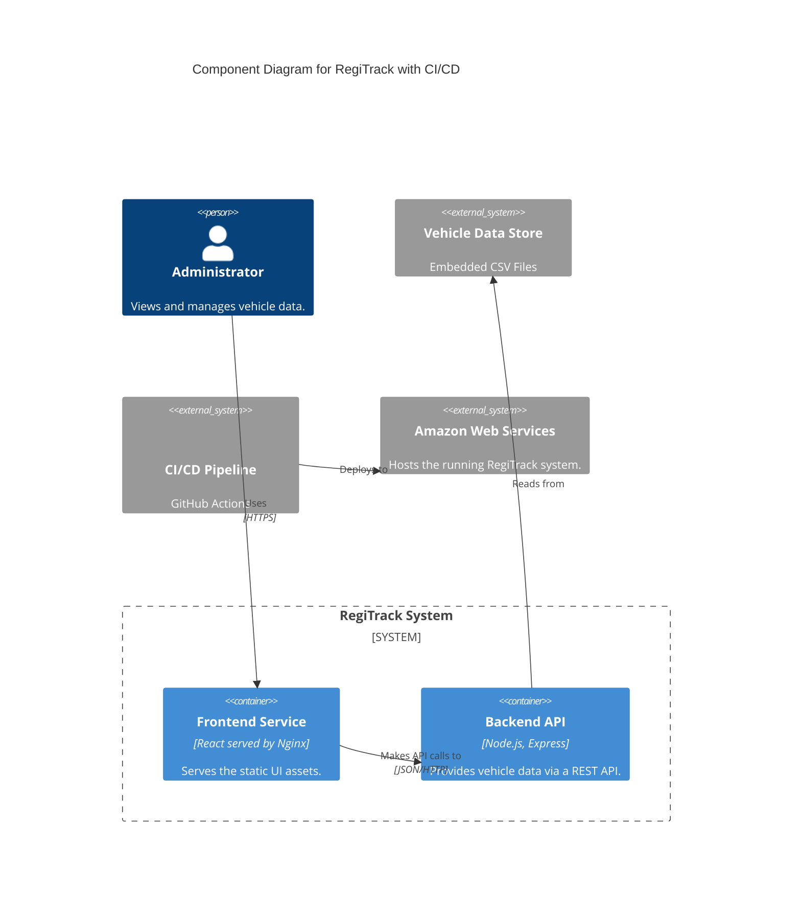
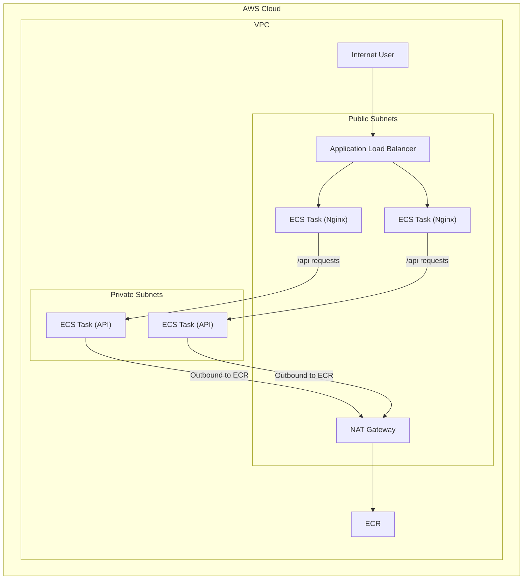

**Architecture-as-Code (AaC) Artifacts:**

**1. Logical View (C4 Component Diagram)**

**2. Physical View (AWS Deployment Diagram)**

**3. Component-to-Resource Mapping Table**

| Logical Component | Physical Resource | Rationale |
| :--- | :--- | :--- |
| Backend API | AWS ECS Fargate Service in **Private Subnets** | Protects the API from direct internet access. |
| (Outbound Access) | AWS NAT Gateway | Provides a secure way for private resources to access the internet. |
