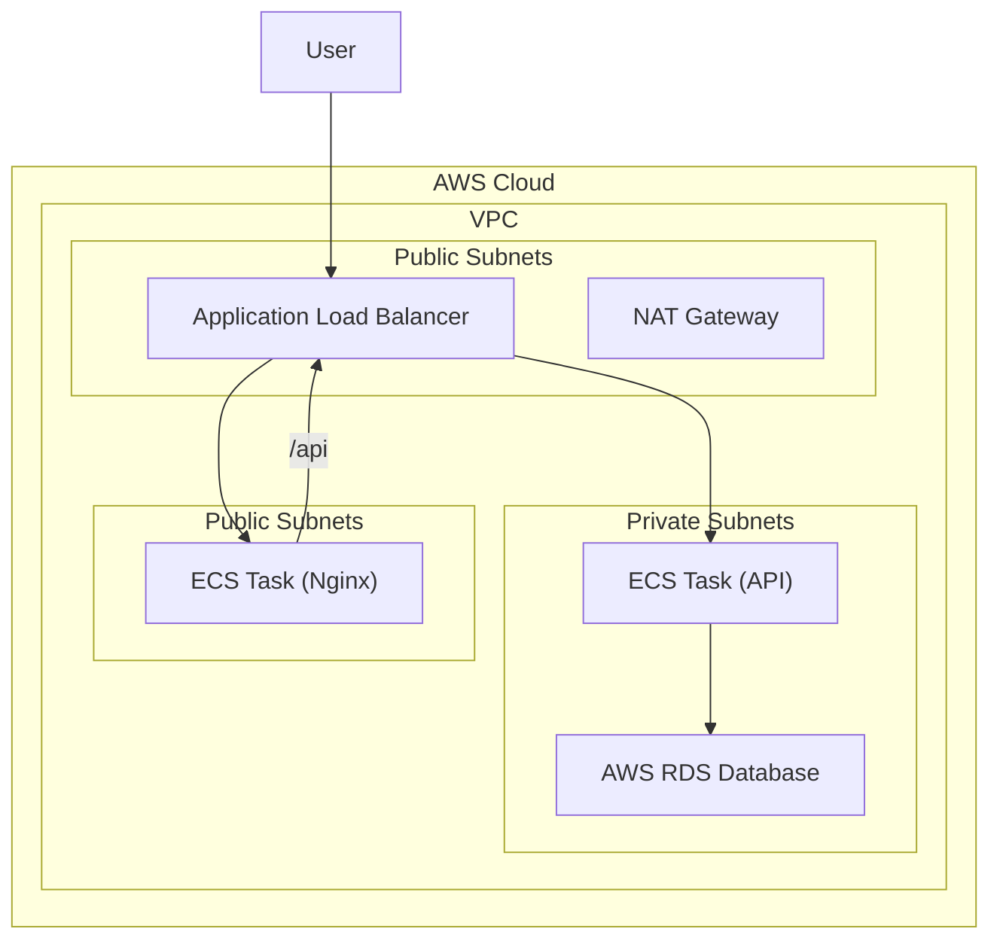

**Architecture-as-Code (AaC) Artifacts:**

**1. Logical View (C4 Component Diagram)**
```mermaid
C4Component
  // ... (admin, frontend, backend are unchanged) ...
  System_Boundary(regitrack, "RegiTrack System") {
    Container(frontend, "Frontend Service", "React served by Nginx")
    Container(backend, "Backend API", "Node.js, Express")
    Database(db, "Relational Database", "Stores vehicle registration data.")
  }

  Rel(admin, frontend, "Uses")
  Rel(frontend, backend, "Makes API calls to")
  Rel(backend, db, "Reads from and writes to", "SQL")
```

**2. Physical View (AWS Deployment Diagram)**


**3. Component-to-Resource Mapping Table**

| Logical Component | Physical Resource | Rationale |
| :--- | :--- | :--- |
| Relational Database | AWS RDS (e.g., PostgreSQL) | Fully managed, highly available, and secure database service. |
