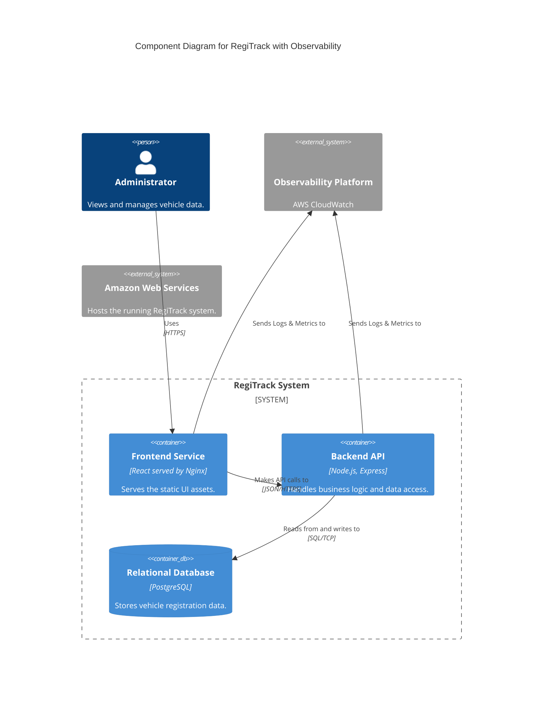
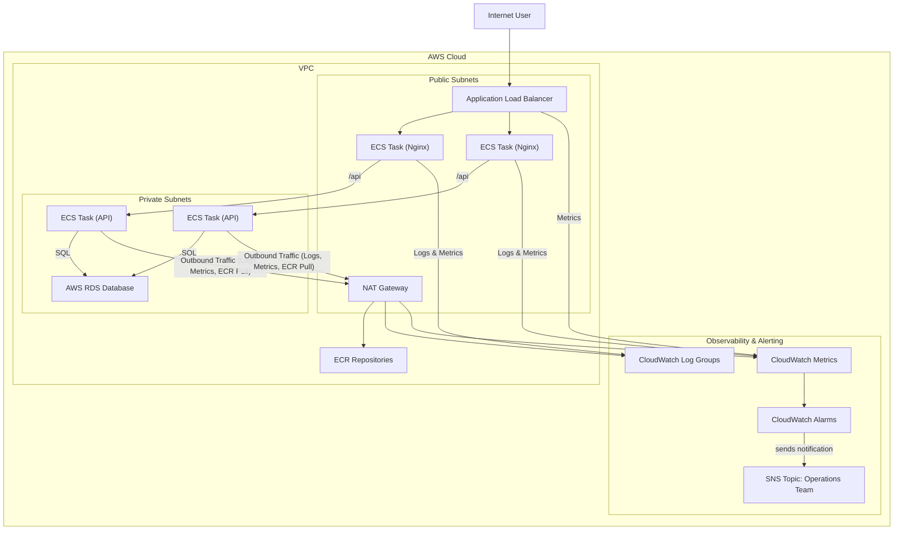

**Architecture-as-Code (AaC) Artifacts:**

**1. Logical View (C4 Component Diagram)**

**2. Physical View (AWS Deployment Diagram)**

**3. Component-to-Resource Mapping Table**

| Logical Component | Physical Resource | Rationale |
| :--- | :--- | :--- |
| (Logging) | AWS CloudWatch Logs | Native, serverless log aggregation for ECS. |
| (Monitoring) | AWS CloudWatch Metrics | Default, high-quality metrics for all AWS services. |
| (Alerting) | AWS CloudWatch Alarms & SNS | Native, reliable alerting mechanism. |
