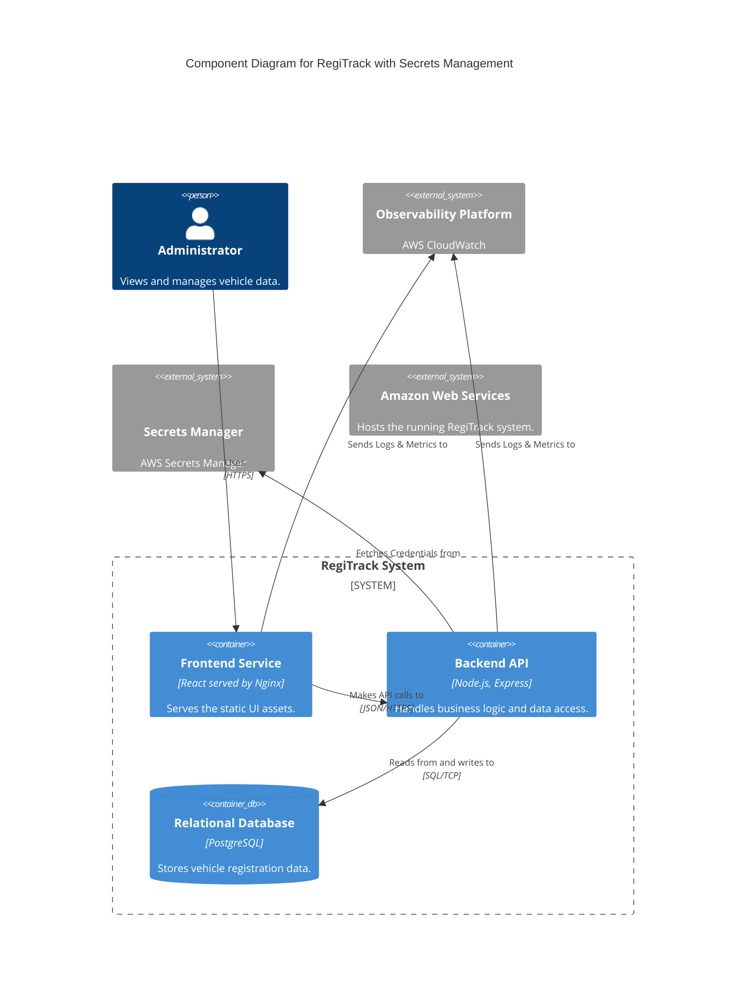
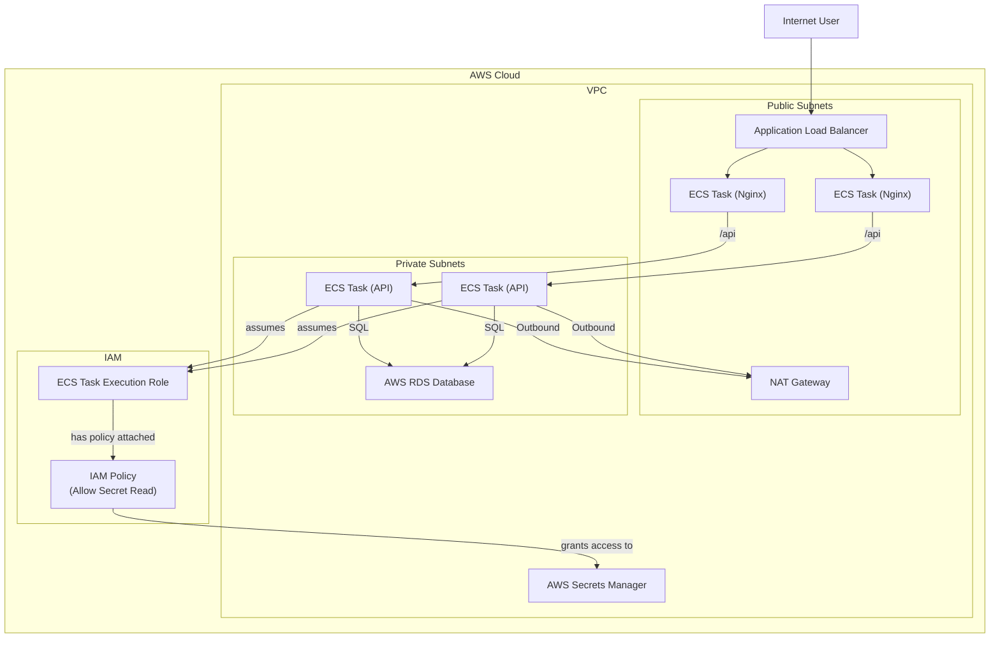

### **Architecture-as-Code (AaC) Artifacts:**

#### **1. Logical View (C4 Component Diagram)**

This diagram is updated to show that the `Backend API` now has a dependency on a dedicated secrets management system.

#### **2. Physical View (AWS Deployment Diagram)**

This diagram shows the new `Secrets Manager` service and the crucial `IAM Policy` that grants the API tasks permission to access it.

#### **3. Component-to-Resource Mapping Table**

| Logical Component | Physical Resource | Rationale |
| :--- | :--- | :--- |
| **(Secret Storage)** | **AWS Secrets Manager** | **A fully managed, highly secure service for storing credentials with built-in encryption, access control, and auditing.** |
| Backend API | AWS ECS Fargate Service | (Rationale unchanged) |
| Frontend Service | AWS ECS Fargate Service | (Rationale unchanged) |
| Relational Database | AWS RDS | (Rationale unchanged) |
| Observability Platform | AWS CloudWatch | (Rationale unchanged) |
