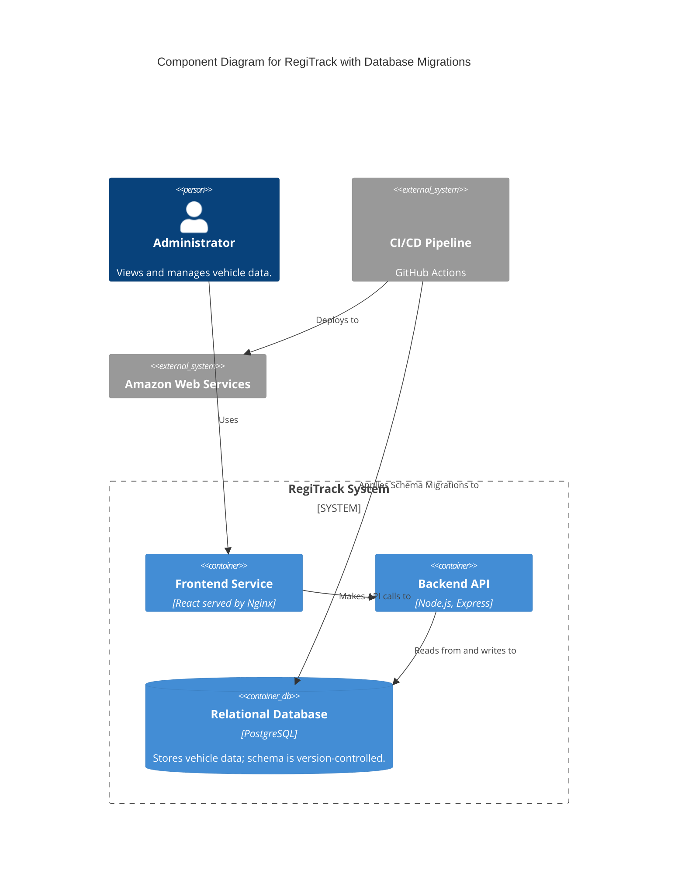
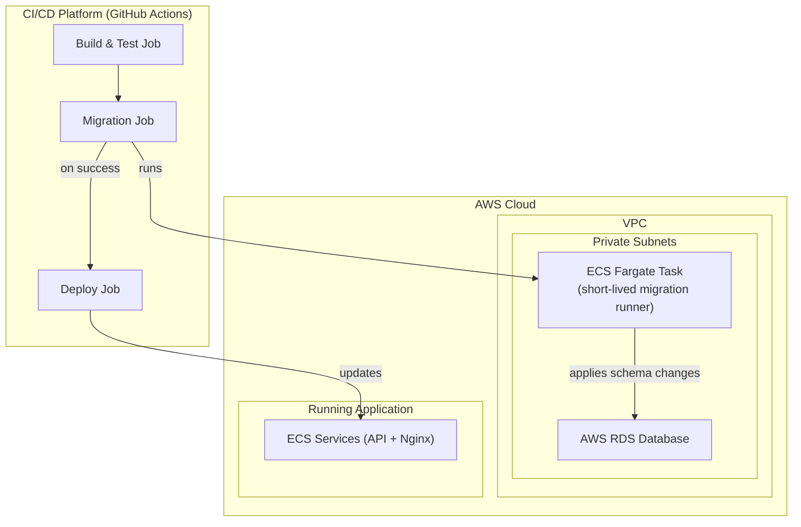

### **Architecture-as-Code (AaC) Artifacts:**

#### **1. Logical View (C4 Component Diagram)**

The logical view is updated to show that the CI/CD pipeline now has a direct, privileged relationship with the database to manage its schema.

#### **2. Physical View (AWS Deployment Diagram)**

This diagram shows the new `Migration Task` as part of the CI/CD process. This is a short-lived task that runs within our VPC to gain access to the private database.

#### **3. Component-to-Resource Mapping Table**

| Logical Component | Physical Resource | Rationale |
| :--- | :--- | :--- |
| **(Schema Management)** | **ECS Fargate "Run Task"** | **A mechanism to run a short-lived, one-off containerized task (the migration script) with secure access to the private network and database.** |
| Backend API | AWS ECS Fargate Service | (Rationale unchanged) |
| Frontend Service | AWS ECS Fargate Service | (Rationale unchanged) |
| Relational Database | AWS RDS | (Rationale unchanged) |
