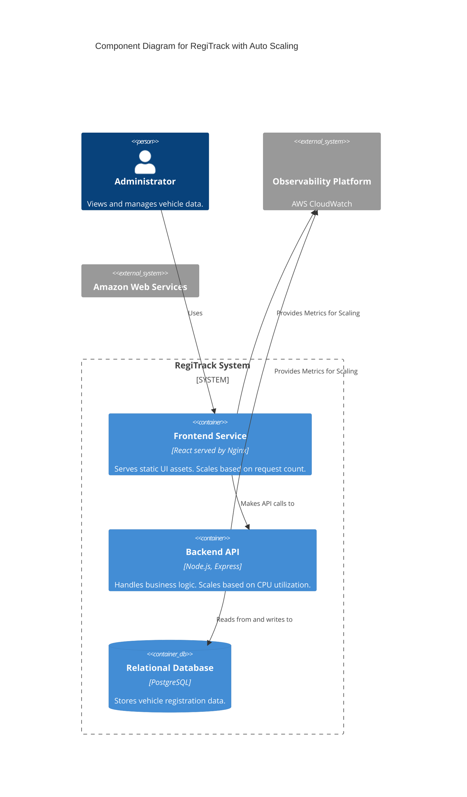
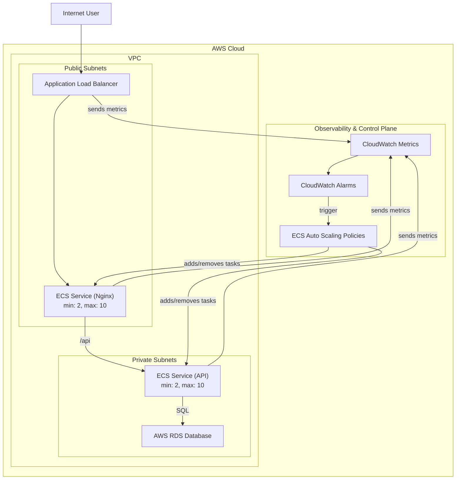

### **Architecture-as-Code (AaC) Artifacts:**

#### **1. Logical View (C4 Component Diagram)**

The logical view is updated to show that our containers now have a new, dynamic attribute: they are auto-scaling.

#### **2. Physical View (AWS Deployment Diagram)**

This diagram shows the new auto scaling components and their relationship with CloudWatch alarms.

#### **3. Component-to-Resource Mapping Table**

| Logical Component | Physical Resource | Rationale |
| :--- | :--- | :--- |
| **(Service Resiliency)** | **AWS Application Auto Scaling** | **Natively integrated with ECS and CloudWatch. Provides a simple and powerful way to configure and manage elastic scaling for our containerized services.** |
| Backend API | AWS ECS Fargate Service | (Rationale unchanged) |
| Frontend Service | AWS ECS Fargate Service | (Rationale unchanged) |
| Relational Database | AWS RDS | (Rationale unchanged) |
